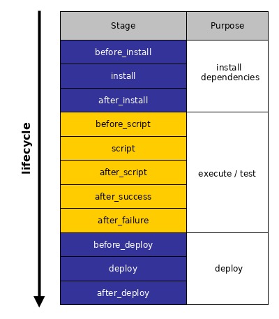

# Build lifecycle

## Stages

CI services run builds in stages. Stages are usually ordered as follows:



The `after_xxx` stages are executed conditionally after their
corresponding `xxx` stage.

- The `after_deploy` stage will only be run if the `deploy` stage was
  run before.
- The `after_success` stage will only be run if the `script` stage
  executed successfully, i.e. without error; otherwise `after_failure`
  will be run instead.

*tic* also relies on a “stage” based approach. All action that should be
run in a certain stage are defined in `tic.R`. The steps are specified
in an CI-agnostic way using R syntax.

The majority of the template code consists of glue code and is not meant
to be edited.

In a nutshell, the workflow is as follows:

CI YAML -\> `tic.R` -\> commands/steps to execute

Some important points:

- The R code declared in `tic.R` is not meant to be run manually. It
  also does not trigger a CI build. All commands just define the
  workflow of the CI build.
- The workflow can be loaded using
  [`dsl_load()`](https://docs.ropensci.org/tic/dev/reference/dsl_get.md),
  however this will not run any of the commands defined.
- For testing purposes, all stages and steps defined in `tic.R` can be
  executed by calling
  [`run_all_stages()`](https://docs.ropensci.org/tic/dev/reference/run_all_stages.md).
  This emulates a CI build on your local system. See [Troubleshooting:
  Running tic
  locally](https://docs.ropensci.org/tic/dev/articles/advanced#troubleshooting-running-tic-locally)
  for more information.

### Accessing a single stage

The steps which are executed in each stage are specified in `tic.R`. A
stage is executed by calling the respective *tic* function; for example
for stage “deploy”
[`tic::deploy()`](https://docs.ropensci.org/tic/dev/reference/stages.md).
This is what happens in the CI YAML templates if you take a closer look
at them.

These functions then source `tic.R` and collect all steps which belong
to their stage by executing `get_stage("<stage name>")`
(e.g. `get_stage("deploy")` for the “deploy” stage”).

Again, remember that the order of the stages is fixed (see the
[“Stages”](#stages) section), it does not matter in which order you
declare the stages in `tic.R`.

### Details of stages

#### The `"before_install"` & `"install"` stages

An important stage for {tic} is the `"before_install"` stage. Here,
{tic} itself gets installed and runs
[`prepare_all_stages()`](https://docs.ropensci.org/tic/dev/reference/prepare_all_stages.md).
This function ensures that all subsequent steps can be executed. Under
the hood the `prepare()` method of all steps that were declared in
`tic.R` is being called. For example, the `prepare()` method of the
[`step_rcmdcheck()`](https://docs.ropensci.org/tic/dev/reference/step_rcmdcheck.md)
step ensures that all dependencies of an R package get installed by
calling
[`remotes::install_deps()`](https://remotes.r-lib.org/reference/install_deps.html).

All packages that should be stored in the “cache” of the CI service (so
that they do not need to be installed again on every CI build) should be
installed during preparation.

#### The `"script"` stage

The `"script"` stage is responsible for executing the important tasks of
the CI run: Typically, it runs `R CMD check` for a package or builds the
site for a blogdown site. When arriving at this stage, all dependencies
for a successful run are already installed.

#### The `"deploy"` stage

This stage initiates the deployment (e.g., setting up deployment keys)
and executes it. If you want to automatically build a {pkgdown} site,
you can do it here. See [the article about
deployment](https://docs.ropensci.org/tic/dev/articles/deployment.md)
for more information.

## Steps

Steps are the commands that are executed in each stage. *tic* uses the
[pipe operator](https://magrittr.tidyverse.org/) and the
[`add_step()`](https://docs.ropensci.org/tic/dev/reference/dsl.md)
function to chain steps in `tic.R`, for example

``` r
get_stage("deploy") %>%
  add_step(step_build_pkgdown())
```

In the code example above
[`step_build_pkgdown()`](https://docs.ropensci.org/tic/dev/reference/step_build_pkgdown.md)
is added to the `"deploy"` stage and subsequently only run in this
stage. More steps that should be run in this stage could just by piped
after `add_step(step_build_pkgdown())`. In summary, steps are usually
defined using two nested commands:
[`add_step()`](https://docs.ropensci.org/tic/dev/reference/dsl.md) and
the corresponding step, here
[`step_build_pkgdown()`](https://docs.ropensci.org/tic/dev/reference/step_build_pkgdown.md).

Here is a list that shows a rough grouping of the steps into their
default stages:

#### Basic

| Step                                                                                            | Description                                                     |
|-------------------------------------------------------------------------------------------------|-----------------------------------------------------------------|
| [`step_hello_world()`](https://docs.ropensci.org/tic/dev/reference/step_hello_world.md)         | Print “Hello, World!” to the console, helps testing a tic setup |
| [`step_write_text_file()`](https://docs.ropensci.org/tic/dev/reference/step_write_text_file.md) | Creates a text file with arbitrary contents                     |

#### Installation

| Step                                                                                       | Description                                                                                                                          |
|--------------------------------------------------------------------------------------------|--------------------------------------------------------------------------------------------------------------------------------------|
| [`step_install_cran()`](https://docs.ropensci.org/tic/dev/reference/step_install_pkg.md)   | Installs one package from CRAN via [`install.packages()`](https://rdrr.io/r/utils/install.packages.html) if it is not yet installed. |
| [`step_install_github()`](https://docs.ropensci.org/tic/dev/reference/step_install_pkg.md) | Installs one or more packages from GitHub via [`remotes::install_github()`](https://remotes.r-lib.org/reference/install_github.html) |

#### R package specific

| Step                                                                                        | Description                                                                    |
|---------------------------------------------------------------------------------------------|--------------------------------------------------------------------------------|
| [`step_build_pkgdown()`](https://docs.ropensci.org/tic/dev/reference/step_build_pkgdown.md) | Building package documentation via [pkgdown](https://github.com/r-lib/pkgdown) |
| [`step_rcmdcheck()`](https://docs.ropensci.org/tic/dev/reference/step_rcmdcheck.md)         | Run `R CMD check` via the {rcmdcheck} package                                  |

#### Deployment

| Step                                                                                                | Description                                                                                                                                                                                                                                                      |
|-----------------------------------------------------------------------------------------------------|------------------------------------------------------------------------------------------------------------------------------------------------------------------------------------------------------------------------------------------------------------------|
| `step_install_ssh_key()`                                                                            | Make available a private SSH key (which has been added before to your project by [`use_tic()`](https://docs.ropensci.org/tic/dev/reference/use_tic.md) or [`tic::use_ghactions_deploy()`](https://docs.ropensci.org/tic/dev/reference/use_ghactions_deploy.md)). |
| [`step_test_ssh()`](https://docs.ropensci.org/tic/dev/reference/step_test_ssh.md)                   | Test the SSH connection to GitHub, helps troubleshooting deploy problems.                                                                                                                                                                                        |
| [`step_setup_ssh()`](https://docs.ropensci.org/tic/dev/reference/step_setup_ssh.md)                 | Adds to known hosts, installs private key, and tests the connection.                                                                                                                                                                                             |
| [`step_setup_push_deploy()`](https://docs.ropensci.org/tic/dev/reference/step_setup_push_deploy.md) | Clones a repo, initiates author information, and sets up remotes for a subsequent [`step_do_push_deploy()`](https://docs.ropensci.org/tic/dev/reference/step_do_push_deploy.md).                                                                                 |
| [`step_do_push_deploy()`](https://docs.ropensci.org/tic/dev/reference/step_do_push_deploy.md)       | Deploy to GitHub.                                                                                                                                                                                                                                                |
| [`step_push_deploy()`](https://docs.ropensci.org/tic/dev/reference/step_push_deploy.md)             | Combines [`step_setup_push_deploy()`](https://docs.ropensci.org/tic/dev/reference/step_setup_push_deploy.md) and [`step_do_push_deploy()`](https://docs.ropensci.org/tic/dev/reference/step_do_push_deploy.md).                                                  |
