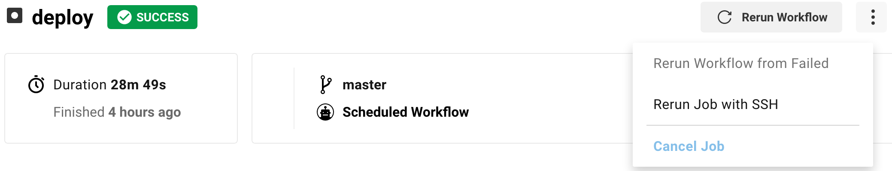

```{r setup, include = FALSE}
knitr::opts_chunk$set(
  collapse = TRUE,
  comment = "#>",
  eval = FALSE
)
```

## Running steps conditionally

Steps and stages can be run conditionally using the control workflow of {tic}.
Possible conditionals are

- Environment variables of the build (queried by `ci_is_env()`, `ci_has_env()` or `ci_get_env()`).
- R Version of the current build (`getRversion()`).
- Other features of the build (e.g. branch name via `ci_get_branch()`).

Common tasks to use this feature are testing on multiple R versions and the restriction of certain tasks that should only be executed once (e.g. the [deployment of a {pkgdown} site](deployment.html#pkgdown-deployment)).

### Conditional execution: Use cases

The following shows some example code blocks to condition certain stages and their respective steps on

- the CI service

```{r eval = FALSE}
if (ci_on_ghactions()) {
  get_stage("<stage>") %>%
    add_step(step_...())
}
```

- a specific branch

```{r eval = FALSE}
if (ci_get_branch() == "main") {
  get_stage("<stage>") %>%
    add_step(step_...())
}
```

## Installation of packages

Required packages are installed based on the "Depends"/"Imports"/"Suggests" fields of the `DESCRIPTION` file.
You should only use the following steps in extraordinary circumstances.
An example can be the use of a package in the `README.Rmd` file which is not listed within the package's `DESCRIPTION` file.

### GitHub packages

```{r eval = FALSE}
get_stage("install") %>%
  add_step(step_install_github("r-lib/rcmdcheck"))
```

Note that the underlying `remotes::install_github()` is vectorized for the `repo` argument which means you can pass all packages you want to install in a single function call:

```{r eval = FALSE}
add_step(step_install_github(c("r-lib/rcmdcheck", "r-lib/usethis")))
```

### CRAN packages

```{r eval = FALSE}
get_stage("install") %>%
  add_step(step_install_cran("magick"))
```

## CI Meta-Information

The `ci()` function and its friends (`ci_*`) hold valuable information about the CI system.
They can be used to query information that can be again be utilized for conditioning stages or steps.

For example, the user may wish to only deploy on GitHub Actions by using `ci_on_ghactions()`:

```{r eval = FALSE}
if (ci_on_ghactions()) {
  get_stage("before_deploy") %>%
    add_step(step_setup_ssh())

  get_stage("deploy") %>%
    add_step(step_push_deploy())
}
```

By using the code above, the specified steps will only be executed on GitHub Actions.
See `?ci` for more information on which CI build information can be extracted from this function.

## Debugging: Running {tic} locally

### Checking for syntax errors

Before pushing to GitHub and triggering a CI build, `tic.R` can be validated using `dsl_load()`.
This function will source `tic.R` to check for possible problems.
If everything is ok, it will return (invisibly) a list with all stages that will be run in the CI build.
Here is a preview of the first two stages:

```{r eval = FALSE}
dsl_load()
```

```
✔ Loading tic stage configuration from tic.R
```

```{r eval = FALSE}
dsl_get()[1:2]
```

```
$before_install
── before_install ──────────────────────────────────────── stage ──
ℹ No steps defined

$install
── install ─────────────────────────────────────────────── stage ──
▶ step_install_github("ropensci/rotemplate")
▶ step_install_deps(repos = repo_default())
```


### Emulating a CI run locally

A tic configuration can be emulated locally.

First, ensure that all prerequisites are met:

```{r eval = FALSE}
prepare_all_stages()
```

This might install additional packages, or even fail with a descriptive message.

Then, run all steps defined in `tic.R`:

```{r}
run_all_stages()
```

This emulates a CI run on your local machine by executing all stages and their corresponding steps.
Note that this action this will use your local system libraries and not the CI environment.
Only the steps that are shown with `dsl_get()` are executed.
Some steps will not be executed as they are conditioned to run on non-interactive environments only, e.g. `add_step(covr::codcov())` added by the macro `do_package_checks()`.

```{r, eval = FALSE}
run_all_stages()
```

```
✓ Loading tic stage configuration from tic.R
Running install: step_install_github("ropensci/rotemplate")
Skipping install of 'rotemplate' from a github remote, the SHA1 (bec3e6eb) has not changed since last install.
  Use `force = TRUE` to force installation
Running install: step_install_deps(repos = repo_default())
```

## Debugging: Entering the CI build directly

### Circle CI

Debugging builds on Circle CI is very convenient.
Go to the web interface and click on the three dots as shown in the screenshot.
Then you can restart your build from the appearing dropdown menu and SSH into the build.

```{r, eval = TRUE, echo=FALSE, fig.align='center'}

```

# What's not covered yet?

- `SystemRequirements`: {tic} is not yet capable of automatically determining system requirements specified in DESCRIPTION files of an R package.
Future plans include to automatically provide suggestions like
