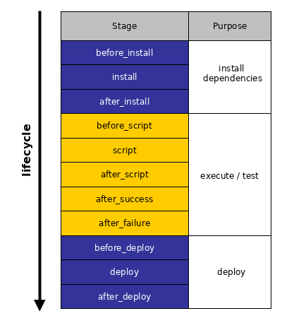

```{r setup, include = FALSE}
knitr::opts_chunk$set(
  collapse = TRUE,
  comment = "#>"
)
```

## Stages

CI services run builds in stages.
Stages are ordered as follows:

```{r, echo = FALSE, fig.align='center', dpi = 50}

```

The `after_xxx` stages are run unconditionally, after their corresponding `xxx` stage.
For example, the `after_deploy` stage will only be run if there the `deploy` stage was run before.
The `after_success` stage will only be run if the `script` stage executed successfully, i.e. without error; otherwise `after_failure` will be run instead.

*tic* also employs an approach based on stages.
All action specifications that should be run in each stage are defined in the `tic.R` file.
The steps are specified in an CI-agnostic way using R syntax.
A large part of the `.travis.yml` file consists of glue code and is not meant to be edited anymore.


```yml
# DO NOT CHANGE THE CODE BELOW
before_install: R -q -e 'install.packages(c("remotes", "curl", "tic")); tic::prepare_all_stages(); tic::before_install()'
install: R -q -e 'tic::install()'
after_install: R -q -e 'tic::after_install()'
before_script: R -q -e 'tic::before_script()'
script: R -q -e 'tic::script()'
after_success: R -q -e 'tic::after_success()'
after_failure: R -q -e 'tic::after_failure()'
before_deploy: R -q -e 'tic::before_deploy()'
deploy:
  provider: script
  script: R -q -e 'tic::deploy()'
  on:
    all_branches: true
after_deploy: R -q -e 'tic::after_deploy()'
after_script: R -q -e 'tic::after_script()'
# DO NOT CHANGE THE CODE ABOVE
```

In a nutshell, the workflow is as follows:

`.travis.yml`/`appveyor.yml` -> `tic.R` -> commands/step to execute

An important point to note: The R code declared in `tic.R` is not meant to be run manually.
It also does not trigger a CI build.
All commands just define the workflow of the CI build.
The workflow can be loaded using `dsl_load()`, this will not run any of the commands defined there.
For testing purposes, all stages and steps defined in `tic.R` can be  executed by calling `run_all_stages()`.
This latter emulates a CI build on your local system.
See [Troubleshooting: Running tic locally](advanced#troubleshooting-running-tic-locally) for more information.

### Accessing a single stage

The steps which are executed in each stage are specified in `tic.R`.
A stage is executed by calling the respective *tic* function; for example for stage "deploy" `tic::deploy()`.
This function then sources `tic.R` and collects all steps added to `get_stage(<stage name>)`, e.g. `get_stage("deploy")` for the "deploy" stage".
Again, remember that the order of the stages is fixed (see [here](#stages)), it does not matter in which order you declare the stages in `tic.R`.

### Details of stages

#### before_install & install

An important stage for *tic* is the `before_install` stage.
Here, *tic* itself gets installed and runs `prepare_all_stages()`.
This function ensures that all subsequent steps can be executed.
Essentially it calls the `prepare()` function of all steps that were declared in `tic.R`.
For example, the `prepare()` function of the `step_rcmdcheck()` step makes sure that all dependencies of an R package get installed by calling `remotes::install_deps()`.

All packages that should be stored in the "cache" of the CI service (so that they do not need to be installed again on every CI build) should be installed during preparation.

#### script

The `script` stage is responsible for executing the important tasks of the CI run: Typically, it runs `R CMD check` for a package, it builds the site for a blogdown site, etc..
In this stage all dependencies for a successful run already are installed.

#### deploy

This stage initiates the deployment (e.g., setting up SSH keys) and executes it.
If you want to automatically build a _pkgdown_ site, you can do it here.
See [the vignette about deployment](deployment.html) for more information.

## Steps

Steps are the commands that are executed in each stage.
*tic* uses the [pipe operator](https://magrittr.tidyverse.org/) and the `add_step()` function to chain steps in `tic.R`, for example

```{r eval = FALSE}
get_stage("deploy") %>%
  add_step(step_build_pkgdown())
```

`step_build_pkgdown()` here is added to the `deploy` stage and subsequently only run in this stage.
More steps that should be run in this stage could just by piped after the `add_step(step_build_pkgdown())` step.
Steps are usually defined using two nested commands: `add_step()` and the corresponding step, here `step_build_pkgdown()`.

We grouped the steps defined by the *tic* package in the following.
Please see the respective help pages of the functions for more detailed documentation.

#### Basic

- `step_hello_world()`: print "Hello, World!" to the console, helps testing a tic setup
- `step_run_code()`: run arbitrary code, optionally run preparatory code and install dependent packages
    - `add_step(step_run_code())` can be abbreviated with `add_code_step()`
- `step_write_text_file()`: Creates a text file with arbitrary contents
    
#### Installation

- `step_install_cran()`: Installs one package from CRAN via `install.packages()`, but only if it's not already installed.
- `step_install_github()`: Installs one or more packages from GitHub via `remotes::install_github()`

#### R package specific

- `step_build_pkgdown()`: building package documentation via [pkgdown](https://github.com/r-lib/pkgdown)
- `step_rcmdcheck()`: run `R CMD check` via the _rcmdcheck_ package
    
##### Deployment

- `step_install_ssh_key()`: make available a private SSH key (which has been added before to your project by [*usethis*](https://github.com/r-lib/usethis)`::use_travis_deploy()`)
- `step_test_ssh()`: test the SSH connection to GitHub, helps troubleshooting deploy problems
- `step_setup_ssh()`: Adds to known hosts, installs private key, and tests the connection
- `step_setup_push_deploy()`: Clones a repo, initiates author information, and sets up remotes for a subsequent `step_do_push_deploy()`
- `step_push_deploy()`: deploy to GitHub, with arguments:
    - `path`: which path to deploy, default: `"."`
    - `branch`: which branch to deploy to, default: `ci_get_branch()`
    - `orphan`: should the branch consist of a single commit that contains all changes (`TRUE`), or should it be updated incrementally (`FALSE`, default)
        - You must specify a `branch` if you set `orphan = TRUE`
    - `remote_url`: the remote URL to push to, default: the URL related to the Travis run
    - `commit_message`: the commit message, will by default contain `[ci skip]` to avoid a loop, and useful information related to the CI run
    - `commit_paths`: Which path(s) to commit. Useful to only commit single files that have changed during the CI run.
    
### Macros

Macros in *tic* are combinations of steps for reoccurring workflows to keep `tic.R` tidy.
The macro function `do_package_checks()` comes with the most important steps that are needed for R package checking. 
It adds the following steps:

1. `step_rcmdcheck()` in the `script` stage, using the `error_on`, `args`, `build_args`, `repos` and `timeout` arguments.

2. A call to `covr::codecov()` in the "after_success" stage.

If you manually add these steps to stages in `tic.R` while `do_package_checks()` is still present, the steps will be executed twice. 

Macros do not need to include steps across stages, they can also just cover a sequence of steps of a single stage.

Currently, `do_package_checks()` is the only macro implemented. 
We will add more macros in the future.
If you have a good use case for a macro, let us know by opening an [issue](https://github.com/ropenscilabs/tic/issues).
