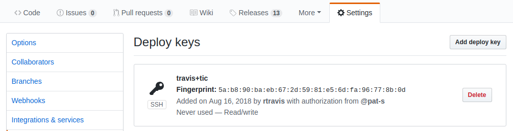
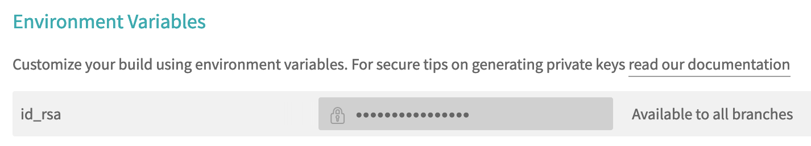

```{r setup, include = FALSE}
knitr::opts_chunk$set(
  collapse = TRUE,
  comment = "#>"
)
```

*tic* handles the deployment as follows:

1. When calling `travis::use_travis_deploy()` (either directly or indirectly by using `usethis::use_ci()`), a public key is added to GitHub repository under the "Deploy keys" section and the user receives an e-mail:

    ```{r, echo = FALSE, fig.align='center', dpi = 10}
    
    ```
    
2. A private key is encoded in base64 and stored in an environment variable on Travis. During the CI run, _tic_ installs it in the `~/.ssh` directory so that it can be used for authentication:

    ```{r, echo = FALSE, fig.align='center', dpi = 10}
    
    ```
    
    Initiating the deployment via a public-private key pair has the advantage that rights are granted to a single repo only and the setup process can be automated.
    Additionally, when calling `use_ci()` a Personal Access token (PAT) is created (by `travis::create_github_pat()`) to avoid the errors caused by GitHubs download rate limitations. 

## pkgdown deployment

[`pkgdown`](https://github.com/r-lib/pkgdown) is a R package that builds a documentation wrapper-site of a package.
It collects all the vignettes, function references and metadata information of a package and presents it in an eye-appealing web version.
Without a `pkgdown` site, these package resources need either be collected from various places (Github repository, CRAN function reference) or do even require a local installation of the package if vignettes are placed in custom locations. 
Therefore, it has become a quasi-standard to have a _pkgdown_ site for a R package.
However, it is tedious to update the site on every commit and check whether something has changed.
On the other hand, the presence of a `pkgdown` site is only really valuable to the user if the content reflects the most recent state of the package.
_tic_ has the ability to automate the update tasks and having the site reflecting the latest state of the package.

The following example shows how _tic_ deploys a `pkgdown` site on Travis.
In the `.travis.yml` file: 

```{yml eval = FALSE}
before_deploy: R -q -e 'tic::before_deploy()'
deploy:
  provider: script
  script: R -q -e 'tic::deploy()'
  on:
    all_branches: true
```

Let's break down what happens here:

1. Travis executes `tic::before_deploy()` which will search for instructions regarding the `before_deploy()` stage in `tic.R`. 

    By default this stage looks like

    ```{r eval = FALSE}
    if (Sys.getenv("BUILD_PKGDOWN") != "") {
      get_stage("before_deploy") %>%
        add_step(step_setup_ssh())
    }
    ```

    This block calls the function `step_setup_ ssh()` if the environment variable `"BUILD_PKGDOWN"` is set in the Travis build.
    That is just an example of an option that can be set to run certain commands (or stages) conditionally (see [here](advanced.html#running-stages-conditionally) for more examples).
    After the prerequisite of setting up an ssh key for the upcoming deployment has been finished, 

2. Travis is told to use a "script" (provider: script) for the deployment (which holds further instructions).

3. This "script" is calling `tic::deploy()`.

4. All this is happening on every branch. If you want to restrict it to certain branches only, you need to set a condition in `tic.R`.

    What happens now is that `tic::deploy()` again searches in `tic.R` for the "deploy" stage and then runs whatever is specified there.

    With the default template of `tic.R`, the following will be executed:

    ```{r eval = FALSE}
    get_stage("deploy") %>%
      add_step(step_build_pkgdown()) %>% 
      add_step(step_push_deploy())
    ```

    First, `step_build_pkgdown()` will build your _pkgdown_ site and afterwards (note the `pipe` operator chaining the commands), `step_push_deploy()` takes care pushing the results to the repo.
    By default this will be the `docs/` directory of the `master` branch.
    
### Deploying to docs/ (master) or gh-pages branch

#### master branch

By default the deployment is done to the `docs/` directory of the `master` branch.
This option has the following advantages:

- You can have per-branch versions of your _pkgdown_ site
- Per-branch versions enable the possibility to have preview for pull requests via https://www.netlify.com/

A disadvantage is that the `master` branch will be cluttered by automatic commits triggered by Travis that push the changes of the _pkgdown_ site to the `master` branch.

#### gh-pages branch

You can optionally set the deployment branch to `gh-pages` and then change the branch serving your site in the GitHub repo settings (change it to `gh-pages`).
This option has the advantage 

- to not have all the automatic commits from Travis in the `master` branch -> the _pkgdown_ site will be "silently" updated in the background in the `gh-pages` branch.

A disadvantage is that you cannot have per-branch versions of your site and hence no pull request previews of the site.

To use this option with *tic*, specify `branch = "gh-pages", path = "docs"` in `step_push_deploy()`.
As the site serving in this setting will use the root of the branch, the `gh-pages` branch will only consist of the public _pkgdown_ files used to serve the site. 

## Conditional deployment

If you are running a [build matrix](https://docs.travis-ci.com/user/build-matrix/) or [build stages](https://docs.travis-ci.com/user/build-stages/) on Travis, you want to run certain tasks only once during a build. 
The creation of a _pkgdown_ site is a common task which applies to this.

Another situation in which conditioning comes in handy is when you want to deploy multiple files in different stages.
You can restrict on which stage/job a task is executed with the help of environment variables.
There are two ways to restrict the deployment with *tic* and environment variables: 

1. Setting the condition in `tic.R` (recommended)
2. Setting the condition in the "deploy" section in `.travis.yml` (see [1](https://docs.travis-ci.com/user/conditional-builds-stages-jobs/), [2](https://docs.travis-ci.com/user/deployment/#conditional-releases-with-on))

_tic_ can make use of implicit set environment variables of the build and additional ones added by the user.
In the following we show a "build stage" example on Travis using the custom env variable `"BUILD_PKGDOWN"`:

`.travis.yml`:

```{yml eval = FALSE}
jobs:
  include:
    - stage: stage1
      env: BUILD_PKGDOWN=TRUE
      before_install: 
        - R -q -e 'install.packages("remotes")'
        - R -q -e 'remotes::install_github("ropenscilabs/tic")'
        - R -q -e 'tic::prepare_all_stages(); tic::before_install()'
      [...]
      deploy:
        provider: script
        script: R -q -e 'tic::deploy()'
        on:
          all_branches: true
```

`tic.R`:

```{r eval = FALSE}
if (Sys.getenv("id_rsa") != "") {
  get_stage("before_deploy") %>%
    add_step(step_setup_ssh())
}

if (isTRUE("BUILD_PKGDOWN")) {
  get_stage("deploy") %>%
    add_step(step_build_pkgdown()) %>%
    add_step(step_push_deploy())
}
```

## Committing single files

The `step_push_deploy()` function has the ability to restrict the files that are commited and pushed.
This can be very useful for conditionally pushing documentation files like `NEWS` or `man/` and `NAMESPACE` if these are automatically created via Travis.

In the following example, these files are created/updated by calling `devtools::document()`.
The `commit_paths` argument in `step_push_deploy()` decides which files are committed and pushed:

```{r eval = FALSE}
get_stage("before_deploy") %>%
    add_step(step_setup_ssh())

get_stage("deploy") %>%
  add_code_step(devtools::document(roclets = c("rd", "collate", "namespace"))) %>%
  add_step(step_push_deploy(commit_paths = c("NAMESPACE", "man/*")))
```

Applying this idea of course depends on your overall R package development strategy: Commit files like `/man/` and `NS` directly or let them be created by Travis?
An example project that uses the latter strategy is [mlr](https://github.com/mlr-org/mlrng/blob/master/tic.R).
